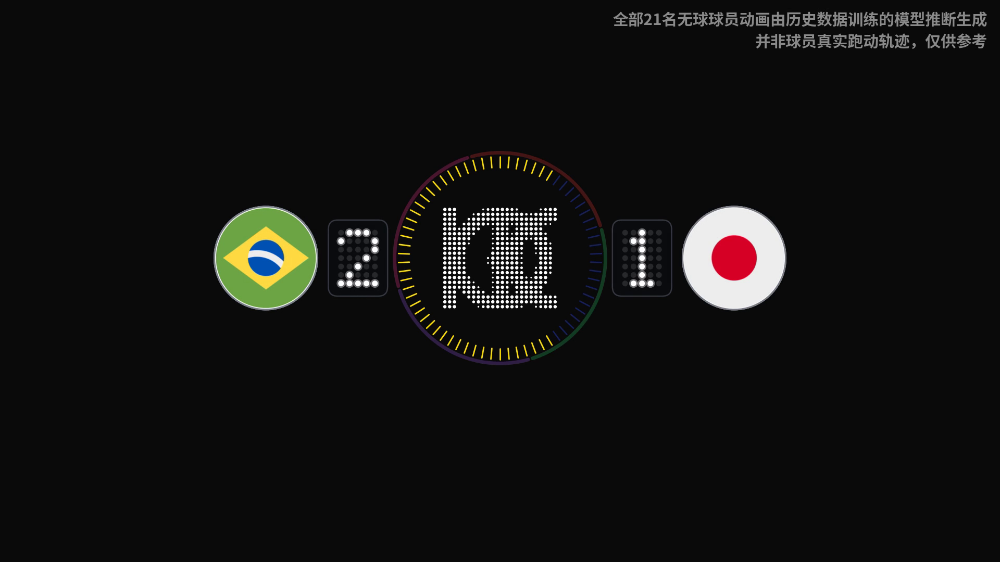
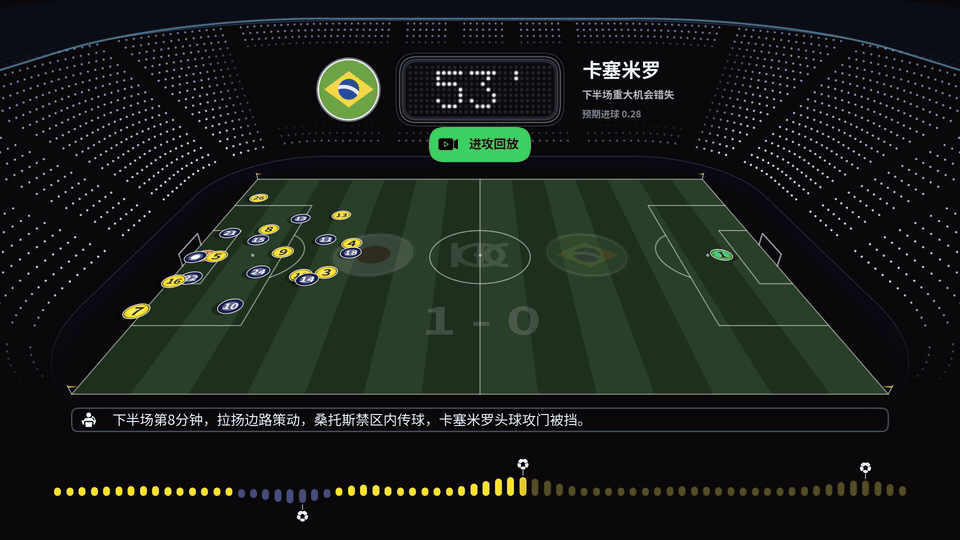
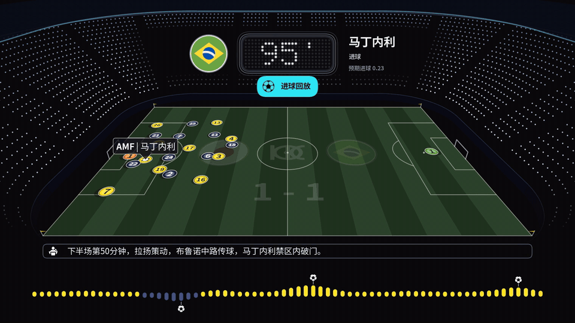
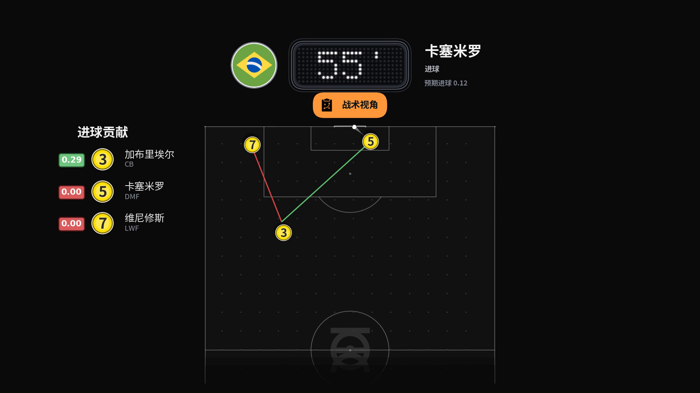
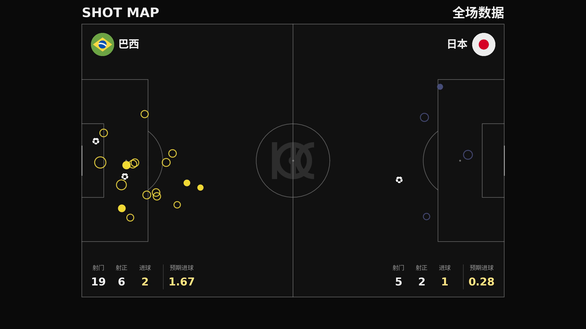
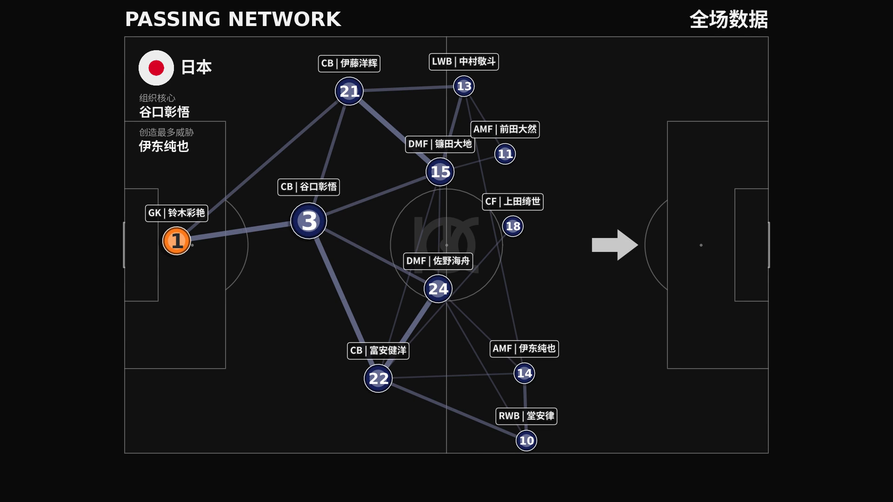
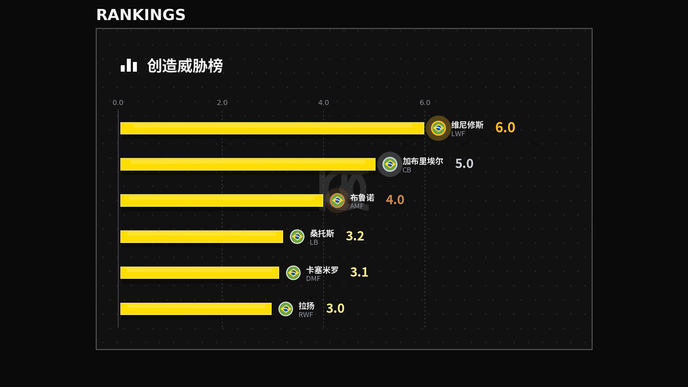
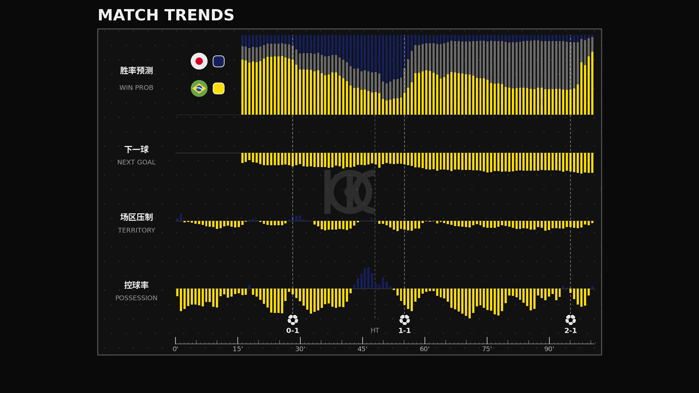
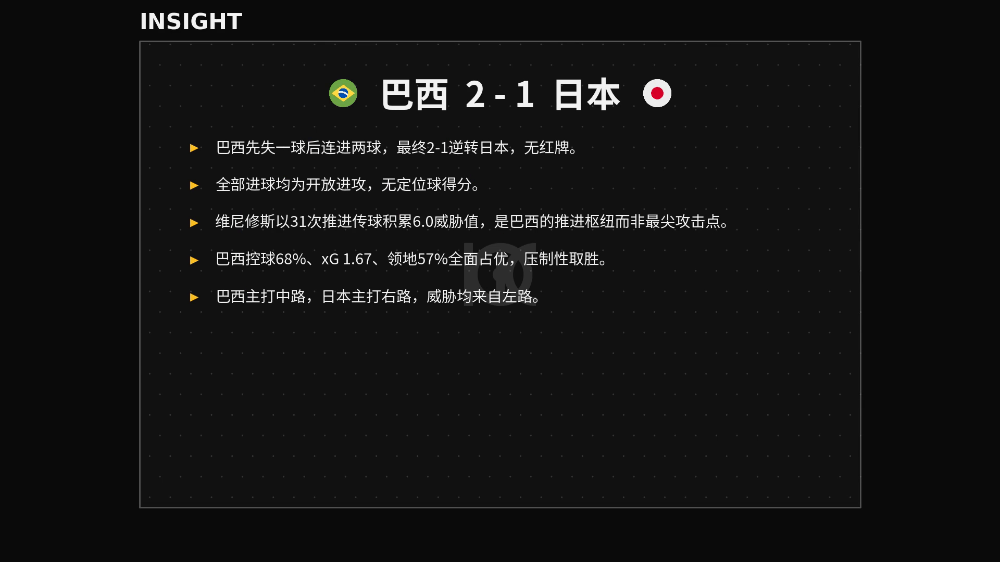

# Pitch Pilot — the tactical replay

**Pitch Pilot is a broadcast service.** It turns a live match into fun facts, insights and tactical
flows for almost every moment of play — so the audience isn't just waiting for the scoring moments,
but understands the match as it unfolds and stays engaged with the broadcast from kick-off to the
whistle.

This guide shows **one segment of that system: the tactical replay**. Give it nothing but the
match's **live data feed** — no broadcast video, no tracking data — and it renders the story as a
broadcast-grade tactical film: the key moments played out on an animated stadium pitch, narrated
caption by caption, with the analytics boards a TV production would cut to. 

The example on this page
is **Brazil 2–1 Japan** (World Cup 2026): 3,921 raw feed events in, one four-minute replay out,
generated end-to-end with no human editing.

## Every key moment, animated

The director reads the match and picks the moments worth telling — every goal, every big chance,
every save — and plays each one out with a short build-up, not as an isolated dot on a chart.
Brazil's 55th-minute equalizer:

The caption names the architecture as it happens: *Vinícius drives down the flank, Gabriel's cross,
Casemiro's header* — and the scoreboard flips from 1-0 to 1-1.

## Who made the goal

After every goal the replay cuts to a **goal contribution** card: the chain that produced it, drawn
in the box, each contributor listed with shirt, role and the value of his touch. One tap deeper
(战术视角 — *tactical view*) replays the move top-down on the full pitch. Brazil's 95th-minute
winner, broken down the moment it lands:

## The boards

At half-time and full-time the replay cuts to the studio boards, every one computed from the same
feed:

**Shot map** — every attempt, sized by xG, with the totals: Brazil 19 shots, 6 on target, xG 1.67;
Japan 5, 2, 0.28.

**Passing network** — average positions, link strength, roles; the callouts name each side's
organizing hub (组织核心) and biggest threat creator (创造最多威胁).

**Player rankings** — threat created, xG, pass accuracy, defensive actions.

**Match trends** — win probability, next-goal odds, territory and possession across the 90 minutes,
goals marked where they landed.

**Insight** — a written verdict, composed automatically from the numbers above: *"Brazil conceded
first, scored twice to win it 2-1 — no red cards… Vinícius accumulated 6.0 threat over 31
progressive passes: Brazil's engine, not their spearhead… 68% possession, xG 1.67, 57% territory —
a controlled win."*

---

*One honest note, printed on the film itself: the ball follows the real event coordinates, while
the 21 off-ball players are animated by a model trained on historical matches — an informed
reconstruction, not recorded tracking data (仅供参考).*
