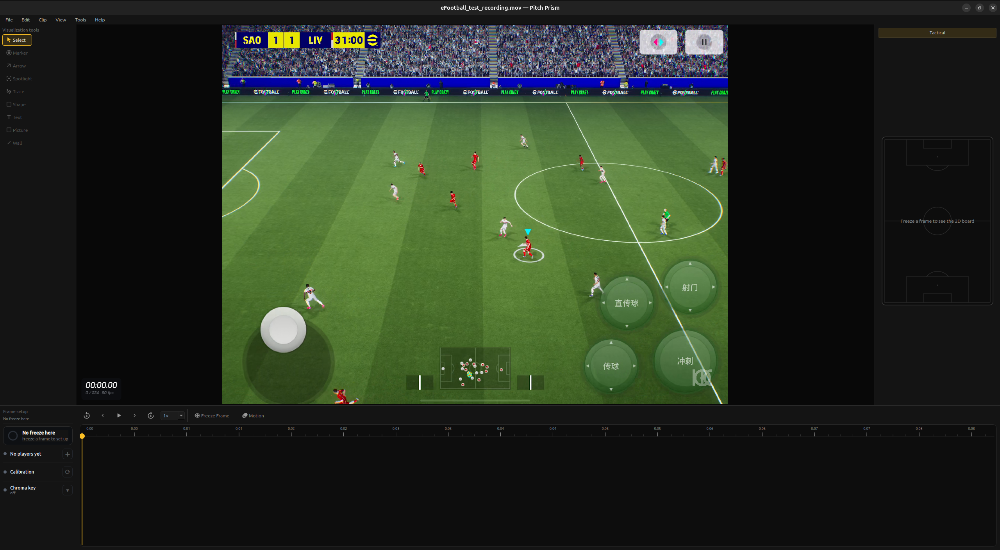
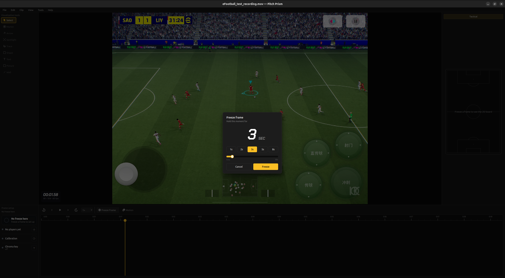
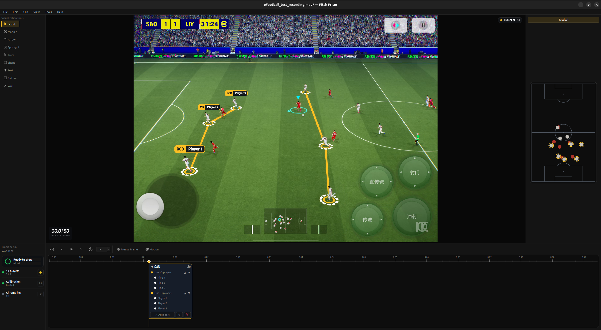
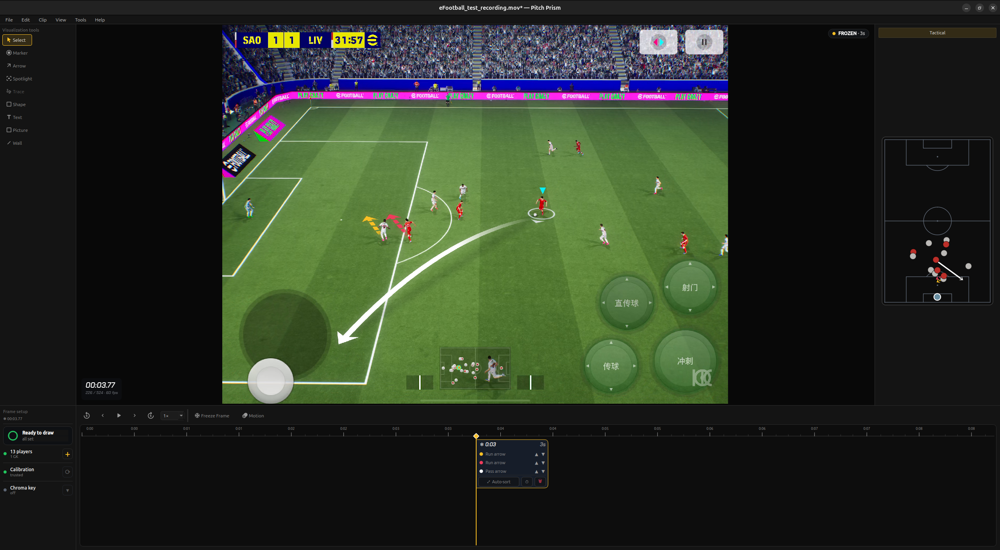
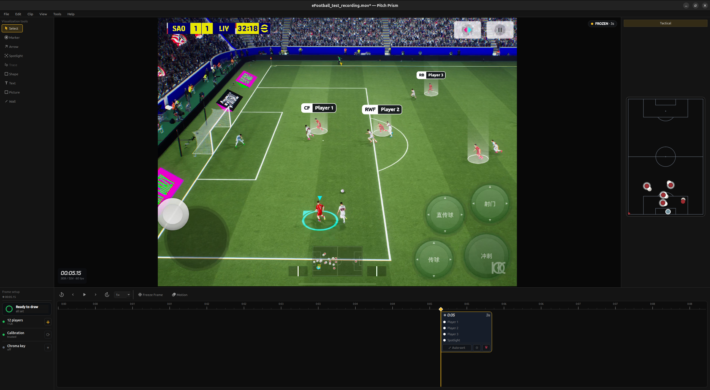
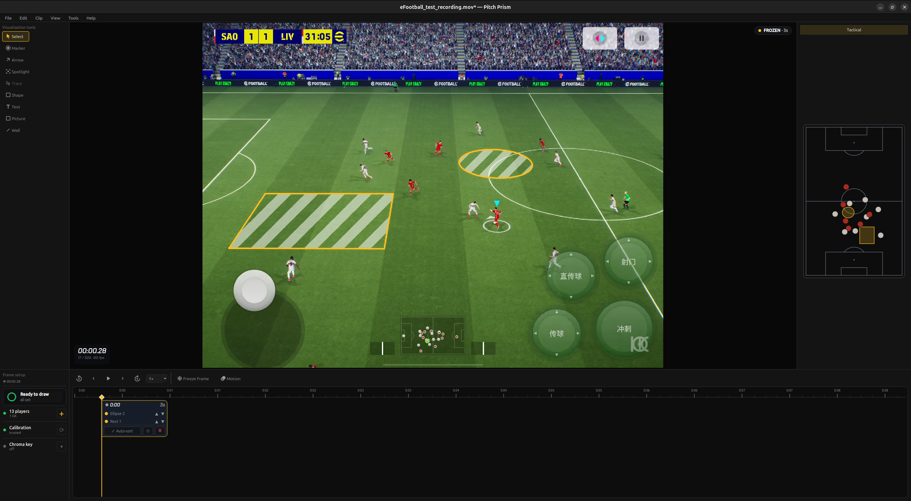
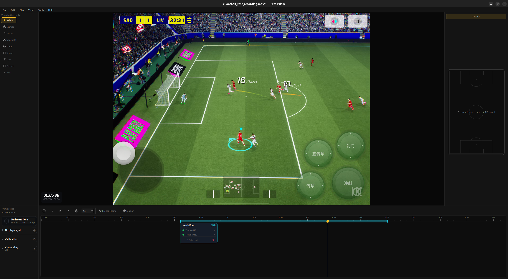
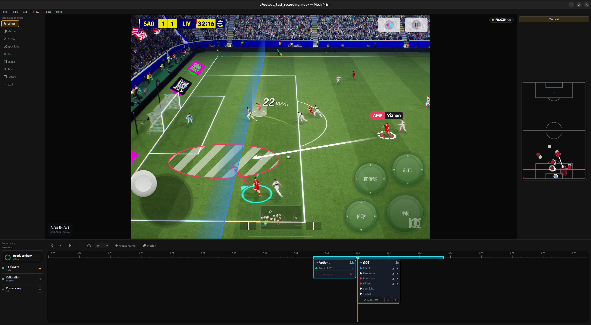

# Pitch Prism

A desktop football telestrator. Load a match clip, freeze a moment (or mark a passage of play), and
draw analysis directly on the pitch — markers, arrows, spotlights, zones and motion trails. The app
calibrates the pitch and detects the players from the footage, so the drawings sit on the real grass
in correct perspective. No manual chroma-keying, player tracking, or camera calibration.

## The interface

- **Tool rail** (left) — the drawing tools: Marker, Arrow, Spotlight, Trace, Shape, Text, and more.
- **Canvas** (centre) — the footage. You draw on the pitch; zoom and pan freely.
- **Frame clock** (bottom-left of the video) — timecode, frame number, frame rate.
- **Watermark** (bottom-right) — your logo, printed onto exports.
- **Tactical board** (right) — a 2D top-down pitch that mirrors every effect in real position.
- **Setup panel** (bottom-left) — players detected, calibration status, chroma key.
- **Transport + timeline** (bottom) — play and scrub, plus the Freeze Frame and Motion buttons.

## Freeze or Motion

Two modes:

- **Freeze** — hold a single frame and draw a still tactical board on it.
- **Motion** — pick a range of play, and the effects follow the players through it.

Press **Freeze Frame** and choose how long to hold the moment. The app detects the players and
calibrates the pitch; when the setup panel turns green, it is ready to draw.

## Tools

### Marker

Click a player to draw a ring on him. Chain several rings into a line or a shape (a back four, a
passing lane), and add name bars with number, role and name. Each ring and group is listed on the
timeline sticker.

### Arrow

Drag from a player into space. A **run** stays flat on the turf; a **pass** lofts and dives into the
target.

### Spotlight

Click a player to light him with a soft cylinder — a clean way to draw the eye. Add a name bar to say
who.

### Shape

Draw a zone — the space between the lines, a pressing trap, a channel. It fills with a zebra or solid
pattern, projects onto the pitch in perspective, and is measured in square metres.

### Motion / Trace

Pick a range on the timeline (the teal band) and a player to **trace**. A speed-trail ribbon follows
him as the passage plays, with live km/h. Markers and spotlights can follow players across the range
too.

## Tactical board

Everything you draw also appears on the right-hand 2D board, in real position — rings, spotlights,
arrows and zones.

## In short

1. Open a clip.
2. Freeze a moment, or mark a Motion range.
3. Draw — and export.

