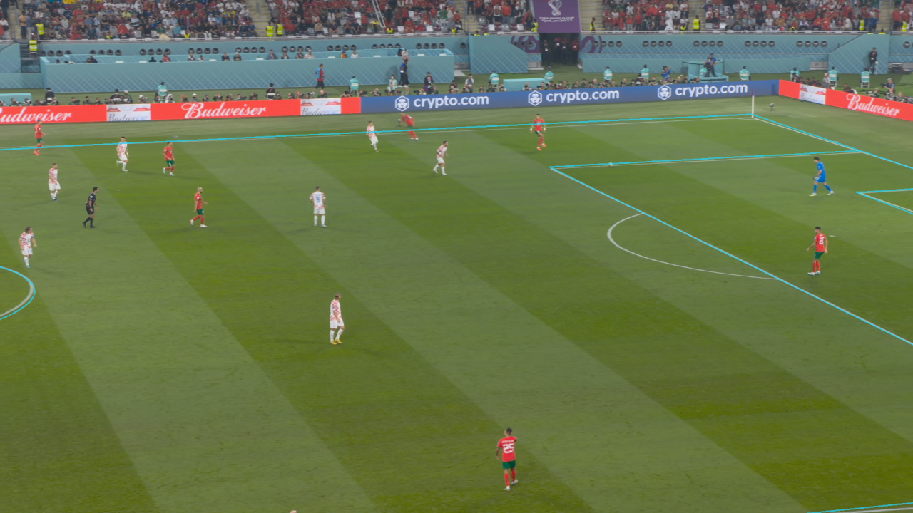
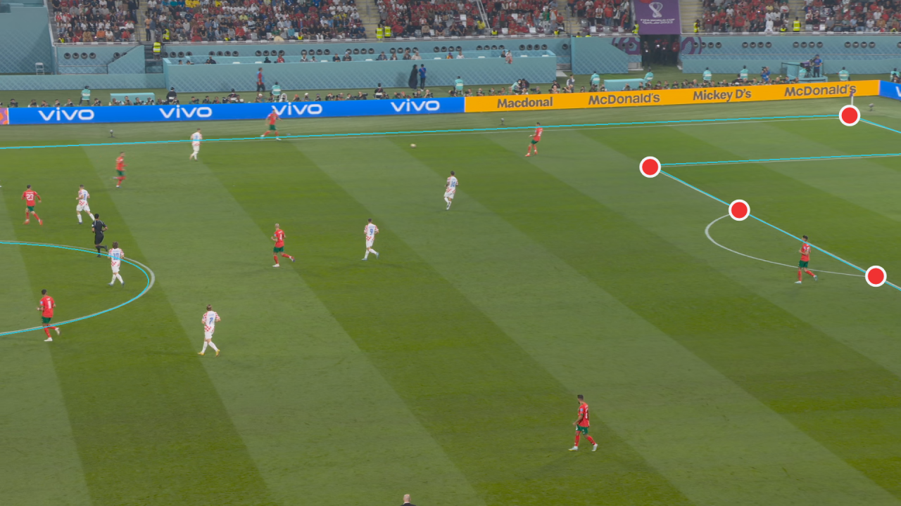
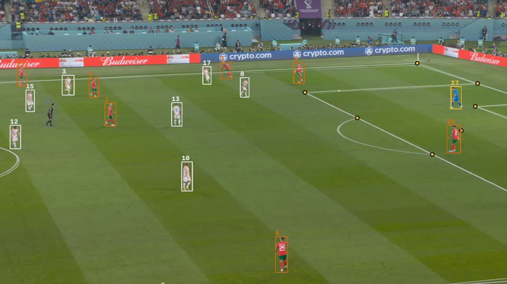

# Broadcast → 2D — Pitch Calibration & Player Tracking

A KICK vision-engine demo. One **ordinary broadcast clip** goes in; a calibrated pitch, a recovered
3D camera, identified players, and a bird's-eye tactical board come out — no tracking chips, no extra
cameras, no manual setup.

> **Clip:** Croatia vs Morocco, FIFA World Cup 2022 — the opening 8 seconds, processed **from the
> very first frame**.

---

## 1 · In the clear, it's exact

Given a normal, information-rich shot, the pipeline solves **where the camera is** and reprojects the
entire FIFA-spec pitch back onto the frame. The full penalty box, penalty arc, goal area, centre
circle and far touchline all land on the painted lines.

- Recovers a full **metric camera** — position, orientation, focal length — every frame, from the
  visible pitch lines alone.
- **Generalises across 4 World Cup stadiums with zero per-venue tuning** (median reprojection ≈ 5 px
  on a 1080p frame).

## 2 · But it's not always this clean

That clean shot is the easy end. Real broadcast throws a lot at a calibrator — these are the failure
modes we've had to solve to keep the overlay honest across a whole match. The *how* stays under the
hood; what matters here is that each one is handled:

1. **Not enough landmarks.** On midfield and wide shots, only a handful of pitch markings are visible.
2. **The mirror trap.** A symmetric pitch can fool a solver into the *wrong half* — or into a camera
   placed *below* the ground.
3. **The wandering camera.** With landmarks clustered in one region, the solved position can drift
   metres and still "fit".
4. **Flicker.** Raw per-frame detections jump and blink from one frame to the next.
5. **Blocked views.** Scoreboards, players and replays cover the lines.

Take a hard one. Below, the detector fired on **just 4 keypoints**, all bunched into one corner of the
frame (red) — nowhere near the spread you'd need to constrain a pitch: too few, and nearly collinear,
to pin down a plane on their own. The full pitch — including the **centre circle on the far side,
where nothing at all was detected** — still locks onto the paint.

## 3 · The recovered camera is real — here it is in 3D

This isn't a flat image trick. What we recover is a **physical camera** — mounted ~19 m up in the
stands, on a fixed mount, panning to follow play, exactly where a real broadcast camera sits. Left:
the broadcast with its overlay. Right: the *same* recovered camera in 3D, its view-frustum footprint
sweeping across the pitch **in lockstep**. Both panels are driven by one per-frame solution.

## 4 · Every player, found and sided

A high-resolution detector finds every player on screen; unsupervised kit-clustering sorts them into
teams — **Morocco (red)** vs **Croatia (white)** — and separates the **goalkeeper and referee** from
the outfield players.

- Three-class detection: **player / goalkeeper / referee**.
- **Per-match team ID** with no hand-coded colours — it learns each match's two kits on the fly.

## 5 · Broadcast → 2D

Put it together and every on-screen player drops onto a bird's-eye board in **real pitch
coordinates** — same numbers, same teams, the shape of play readable at a glance. The raw material
for telestration, tactical overlays and spatial analysis.
